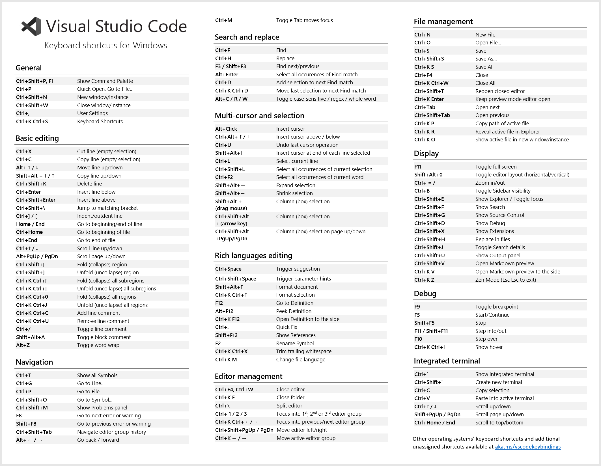

<!--CSS For file-->

<h1 style='background-color:#0D1117;color:white;padding:10px; width:100%;'>VS Code Short Cut</h1>

<h1 style='background-color:#0D1117;color:white;padding:10px; width:100%;'>By Divakar Pal</h1>

